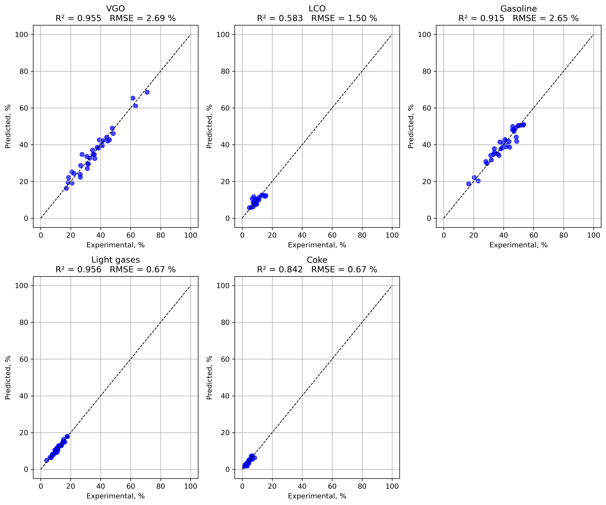

The project applies the concepts of a hybrid neural network ODE model to the catalytic cracking process.
The network construction approach is taken from [1], and the experimental data are from [2].

A 5-lumped model was constructed (VGO, gases, gasoline, LCO, Coke). The vacuum gas oil reaction was chosen as second-order, while the other processes were considered first-order.
As a result of model training, it was possible to achieve higher accuracy compared to the author of the dissertation [2], who used a classical kinetic model. 

In particular, the RMSE for predicting gasoline yield decreased from 4.34% to 2.65%, R2 increased from 0.617 to 0.915; RMSE coke formation predicting decreased from 1.34% to 0.67%, meanwhile R2 increased 0.312 to 0.842. The same situation with the improvement of predictions for the formation of light gases and vacuum gas oil residue: a reduction in RMSE from 1.11 to 0.67% for gas, from 4.69 to 2.69% for gas oil, the coefficients of determination increased from 0.834 to 0.956 for gas, from 0.730 to 0.955 for gas oil.

=====Literature=====  
[1] Fedorov, Aleksandr & Perechodjuk, Anna & Linke, David. Kinetics-Constrained Neural Ordinary Differential Equations: Artificial Neural Network Models tailored for Small Data to boost Kinetic Model Development. 2023   
[2] Jansen G. Acosta-López. Fluid Catalytic Cracking (FCC) Riser Operation: Integrating Experiments, Computational Fluid Dynamics, and Machine Learning Models. The University of Western Ontario. 2025
